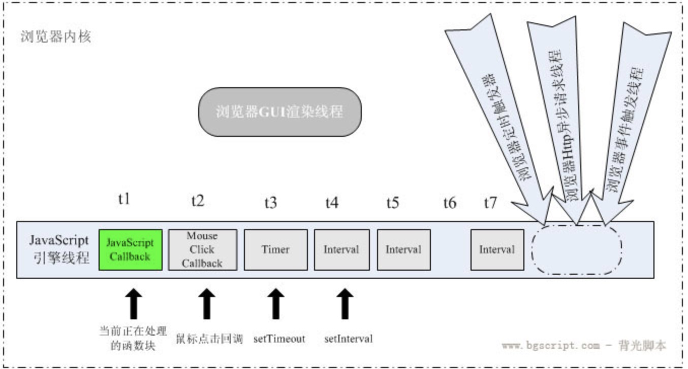

# 定时器
Javascript用来处理延时和定时任务的setTimeOut和setInterval函数应用非常广泛，它们都用来处理延时和定时任务，比如打开网页一段时间后弹出一个登录框，页面每隔一段时间发送异步请求获取最新数据等等。

setTimeout() 方法用于在指定的毫秒数后调用函数或计算表达式,而setInterval()则是在每隔指定的毫秒数循环调用函数或表达式，直到clearInterval把它清除。也就是说setTimeout()只执行一次，setInterval()可以执行多次。两个函数的参数也相同，第一个参数是要执行的code或句柄，第二个是延迟的毫秒数。

## 定义
***setTimeout(code, millisec)***
+ 在指定延迟时间后，调用一个函数或者执行一段代码。
+ 第一个参数为**回调函数**; 第二个参数为**延迟时间**，注意第二个参数的单位是**毫秒**；setTimeout会返回一个**唯一标识**，该标识可用来清楚定时器

例如：
```
var timerId = setTimeout(function(){console.log('settimeout')},1000);
cleartTimeout(timerId)

```

***setInterval(code, millisec)*** 
+ 用指定时间周期性的调用一个函数或者执行一段代码
+ 第一个参数为要周期执行的**回调函数**；第二个参数为试图将回调函数**加入事件队列的时间的周期时间**，注这里时间单位也是**毫秒**；这里还有一个注意点，在往事件队列里添加回调函数时，会先判断事件队列是否存在还没有执行的回调函数，如果存在就不会继续往事件队列里添加回调函数了。setInterval也会返回一个唯一标识，该标识亦可清楚setInterval定时器

例如：
```
var intervalId = setInterval(function(){console.log('setinterval')},1000);
clearInterval(intervalId)
```

## 执行原理
大家都知道，JavaScript是单线程执行的，setTimeout和setInterval执行原理其实也很简单。

+ setTimeout会在调用后的millisec时间间隔后往事件队列里添加回调函数，然后等待执行。
+ setInterval会按照第二个参数的周期时间周期性的往事件队列添加回调函数，然后等待执行，这里的一个注意点是如果事件队列里的回调函数还没有执行，不会重复添加。

***注：*** html5规定setTimeout和setInterval的延迟时间最少为4ms. 所以setTimeout(function(){},0)其实是setTimeout(function(){}, 4)

## Javascript是单线程执行，不代表浏览器是单线程执行
JavaScript线程只是浏览器众多线程里的一部分
```
<script>
 
    function test() {
        console.log('test')
    }
    
    (function(){
 
        var timerId = setTimeout(function(){
            console.log('timeout');
        }, 0);
 
        var intervalId = setInterval(function(){
            console.log('interval')
        },0);
 
 
        console.log("function");
    })()
    
 
</script>

```


## 被遗忘的参数
setTimeout 和 setInterval 除了第一个和第二个参数外，还可以传递第三，第四，第五.....个参数。即：

**setTimeout(code, millisec, arg1, arg2,......, argN)**

**setInterval(code, millisec, arg1, arg2,......, argN)**

从第三个参数开始的所有参数都将作为第一个参数的参数。下面看代码：

```
(function(){
        var timer = window.setTimeout(function(){
            console.log(arguments[0]);   // 输出 a
            console.log(arguments[1])    // 输出 b
        }, 3000, 'a', 'b');
 
        var interval = window.setInterval(function(c){
            console.log(c)  // 循环输出 c
        }, 3000, 'c')
})()

```

————2018.12.18