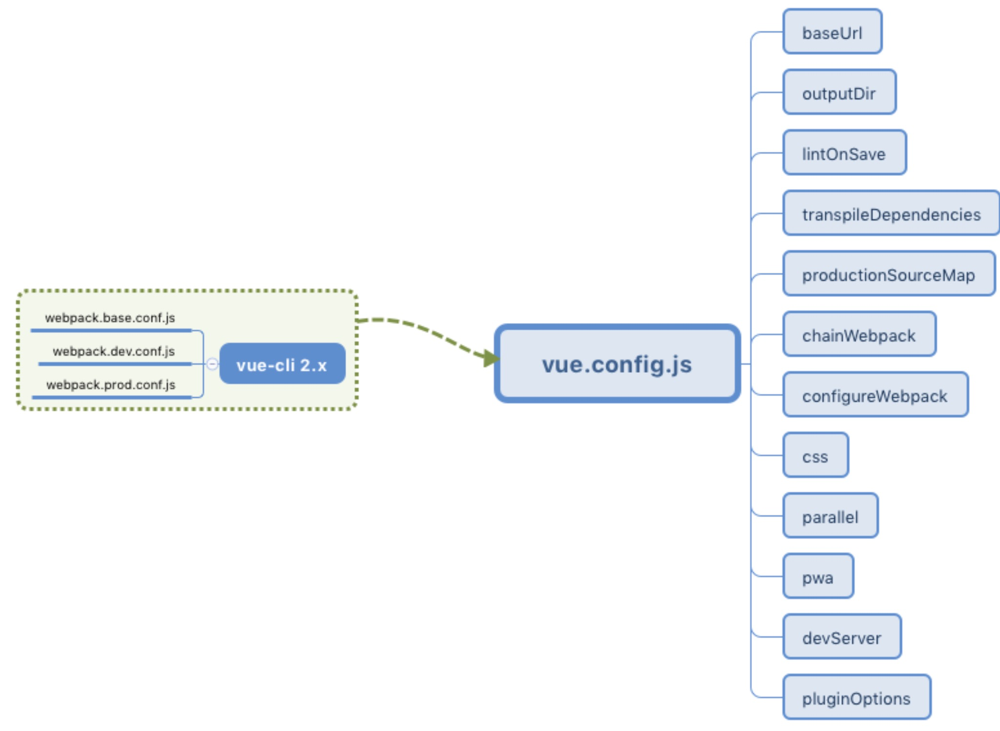
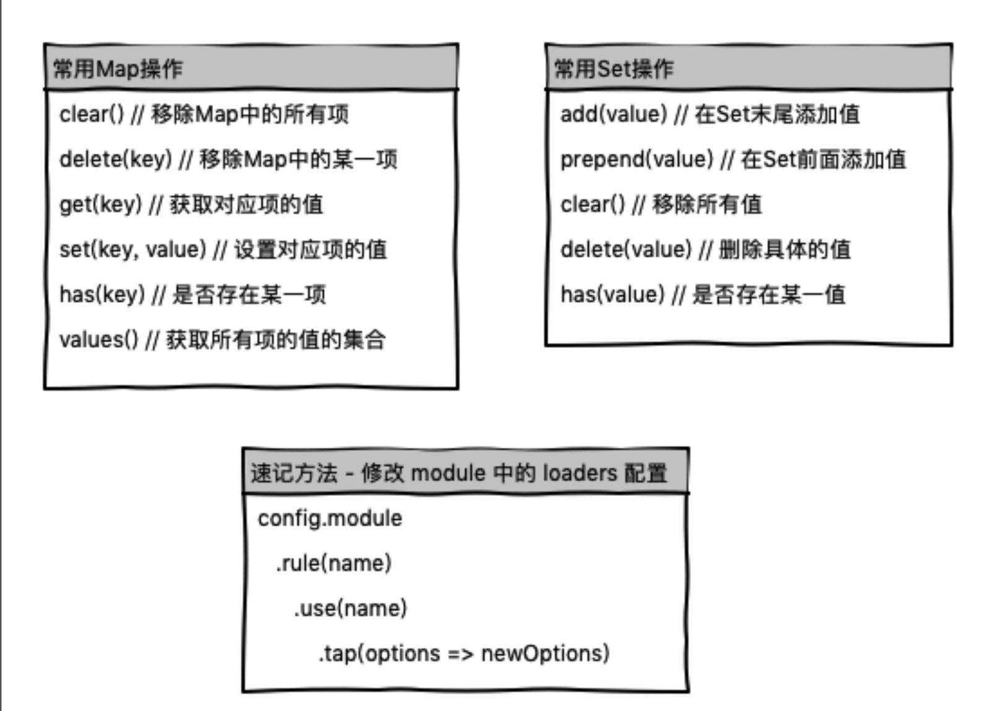

# webpack在CLI3中的应用

## 与 vue-cli 2.x 的差异
如果你使用过 vue-cli 2.x，那么你应该了解其构建出的目录会包含相应的 webpack 配置文件，但是在 vue-cli 3.x 中你却见不到一份关于 webpack 的配置文件，难道 3.x 抛弃了 webpack？其实不然，3.x 提供了一种开箱即用的模式，即你无需配置 webpack 就可以运行项目，并且它提供了一个 vue.config.js 文件来满足开发者对其封装的 webpack 默认配置的修改。如图：



## vue.config.js完整默认配置

```
module.exports = {
  /** 区分打包环境与开发环境
   * process.env.NODE_ENV==='production'  (打包环境)
   * process.env.NODE_ENV==='development' (开发环境)
   * baseUrl: process.env.NODE_ENV==='production'?"https://cdn.didabisai.com/front/":'front/',
   */
 // 基本路径
 baseUrl: '/',
 // 输出文件目录
 outputDir: 'dist',
 // eslint-loader 是否在保存的时候检查
 lintOnSave: true,
 // use the full build with in-browser compiler?
 // https://vuejs.org/v2/guide/installation.html#Runtime-Compiler-vs-Runtime-only
 compiler: false,
 // webpack配置
 // see https://github.com/vuejs/vue-cli/blob/dev/docs/webpack.md
 chainWebpack: () => {},
 configureWebpack: () => {},
 //如果想要引入babel-polyfill可以这样写
 // configureWebpack: (config) => {
 //   config.entry = ["babel-polyfill", "./src/main.js"]
 // },
 // vue-loader 配置项
 // https://vue-loader.vuejs.org/en/options.html
 vueLoader: {},
 // 生产环境是否生成 sourceMap 文件
 productionSourceMap: true,
 // css相关配置
 css: {
  // 是否使用css分离插件 ExtractTextPlugin
  extract: true,
  // 开启 CSS source maps?
  sourceMap: false,
  // css预设器配置项
  loaderOptions: {},
  // 启用 CSS modules for all css / pre-processor files.
  modules: false
 },
 // use thread-loader for babel & TS in production build
 // enabled by default if the machine has more than 1 cores
 parallel: require('os').cpus().length > 1,
 // 是否启用dll
 // See https://github.com/vuejs/vue-cli/blob/dev/docs/cli-service.md#dll-mode
 dll: false,
 // PWA 插件相关配置
 // see https://github.com/vuejs/vue-cli/tree/dev/packages/%40vue/cli-plugin-pwa
 pwa: {},
 // webpack-dev-server 相关配置
 devServer: {
  open: process.platform === 'darwin',
  host: '0.0.0.0',
  port: 8080,
  https: false,
  hotOnly: false,
  proxy: null, // 设置代理
  before: app => {}
 },
 // 第三方插件配置
 pluginOptions: {
  // ...
 }
}

```

## vue.config.js 的配置说明

我们可以清晰的看出 vue.config.js 的配置项结构，如果你构建的项目中没有该文件，那么你需要在根目录手动创建它。下面我们就来介绍一下其常用配置项的功能和用途：


### 1. baseurl

如果现在你想要将项目地址加一个二级目录，比如：http://localhost:8080/vue/，那么我们需要在 vue.config.js 里配置 **baseurl** 这一项：

```
// vue.config.js
module.exports = {
    ...
    
    baseUrl: 'vue',
    
    ...
}
```
其改变的其实是 **webpack** 配置文件中 **output** 的 **publicPath** 项，这时候你重启终端再次打开页面的时候我们首页的 url 就会变成带二级目录的形式。

### 2. outputDir

如果你想将构建好的文件打包输出到 output 文件夹下（默认是 dist 文件夹），你可以配置：

```
// vue.config.js
module.exports = {
    ...
    
    outputDir: 'output',
    
    ...
```

然后运行命令 **yarn build** 或 **npm build** 进行打包输出，你会发现项目跟目录会创建 **output** 文件夹， 这其实改变了 **webpack** 配置中 **output** 下的 **path** 项，修改了文件的输出路径。

### 3. productionSourceMap

该配置项用于设置是否为生产环境构建生成 **source ma**p，一般在生产环境下为了快速定位错误信息，我们都会开启 **source map**：

```
// vue.config.js
module.exports = {
    ...
    
    productionSourceMap: true,
    
    ...
}
```

该配置会修改 **webpack** 中 **devtool** 项的值为 **source-map**。

开启 **source map** 后，我们打包输出的文件中会包含 **js** 对应的 **.map 文件**，其用途可以参考：**[JavaScript Source Map](http://www.ruanyifeng.com/blog/2013/01/javascript_source_map.html)** 详解

### 4. chainWebpack

**chainWebpack** 配置项允许我们更细粒度的控制 webpack 的内部配置，其集成的是 **[webpack-chain](https://github.com/neutrinojs/webpack-chain)** 这一插件，该插件可以让我们能够使用链式操作来修改配置，比如：
```
// 用于做相应的合并处理
const merge = require('webpack-merge');

module.exports = {
    ...
    
    // config 参数为已经解析好的 webpack 配置
    chainWebpack: config => {
        config.module
            .rule('images')
            .use('url-loader')
            .tap(options =>
                merge(options, {
                  limit: 5120,
                })
            )
    }
    
    ...
}
```
以上操作我们可以成功修改 **webpack** 中 **module** 项里配置 **rules** 规则为图片下的 **url-loader** 值，将其 **limit** 限制改为 5M，修改后的 **webpack** 配置代码如下：

```
{
    ...
    
    module: {
        rules: [
            {   
                /* config.module.rule('images') */
                test: /\.(png|jpe?g|gif|webp)(\?.*)?$/,
                use: [
                    /* config.module.rule('images').use('url-loader') */
                    {
                        loader: 'url-loader',
                        options: {
                            limit: 5120,
                            name: 'img/[name].[hash:8].[ext]'
                        }
                    }
                ]
            }
        ]
    }
    
    ...
}

```

这里需要注意的是我们使用了 **webpack-merge** 这一插件，该插件用于做 **webpack** 配置的合并处理，这样 **options** 下面的其他值就不会被覆盖或改变。

关于 webpack-chain 的使用可以参考其 github 官方地址：github.com/mozilla-neu…，它提供了操作类似 JavaScript Set 和 Map 的方式，以及一系列速记方法。



### 5. configureWebpack

除了上述使用 **chainWebpack** 来改变 webpack 内部配置外，我们还可以使用 **configureWebpack** 来进行修改，两者的不同点在于 **chainWebpack** 是链式修改，而 configureWebpack 更倾向于整体替换和修改。示例代码如下：

```
// vue.config.js
module.exports = {
    ...
    
    // config 参数为已经解析好的 webpack 配置
    configureWebpack: config => {
        // config.plugins = []; // 这样会直接将 plugins 置空
        
        // 使用 return 一个对象会通过 webpack-merge 进行合并，plugins 不会置空
        return {
            plugins: []
        }
    }
    
    ...
}
```

**configureWebpack** 可以直接是一个对象，也可以是一个函数，如果是对象它会直接使用 **webpack-merge** 对其进行合并处理，如果是函数，你可以直接使用其 **config** 参数来修改 **webpack** 中的配置，或者返回一个对象来进行 **merge** 处理。

你可以在项目目录下运行 ***vue inspect*** 来查看你修改后的 **webpack** 完整配置，当然你也可以缩小审查范围，比如：

```
# 只查看 plugins 的内容
vue inspect plugins
```

### 6. devServer

**vue.config.js** 还提供了 **devServer** 项用于配置 **webpack-dev-server** 的行为，使得我们可以对本地服务器进行相应配置，我们在命令行中运行的 **yarn serve 或者 npm serve** 对应的命令 **vue-cli-service serve** 其实便是基于 **webpack-dev-server** 开启的一个本地服务器，其常用配置参数如下：

```
// vue.config.js
module.exports = {
    ...
    
    devServer: {
        open: true, // 是否自动打开浏览器页面
        host: '0.0.0.0', // 指定使用一个 host。默认是 localhost
        port: 8080, // 端口地址
        https: false, // 使用https提供服务
        proxy: null, // string | Object 代理设置
        
        // 提供在服务器内部的其他中间件之前执行自定义中间件的能力
        before: app => {
          // `app` 是一个 express 实例
        }
    }
    
    ...
}
```
当然除了以上参数，其支持所有的 **webpack-dev-server** 中的选项，比如 **historyApiFallback** 用于重写路由（会在后续的多页应用配置中讲解）、progress 将运行进度输出到控制台等，具体可参考：**[devServer](https://www.webpackjs.com/configuration/dev-server/)**

以上讲解了 **vue.config.js** 中一些常用的配置项功能，具体的配置实现需要结合实际项目进行，完整的配置项可以查看：**[vue.config.js](https://github.com/vuejs/vue-cli/blob/ce3e2d475d63895cbb40f62425bb6b3237469bcd/docs/zh/config/README.md)**

## 默认插件简介

通过对 **vue.config.js** 的了解，我们知道了 vue-cli 3.x 为我们默认封装了项目运行的常用 webpack 配置，那么它给我们提供了哪些默认插件，每一个 plugin 又有着怎样的用途呢？除了使用 **vue inspect plugins** 我们还可以通过运行 **vue ui** 进入可视化页面查看，步骤如下

- 打开可视化页面，点击对应项目进入管理页面（如果没有对应项目，需要导入或新建）

- 点击侧边栏 Tasks 选项，再点击二级栏 inspect 选项

- 点击 Run task 按钮执行审查命令

最后我们从输出的内容中找到 **plugins** 数组，其包含了如下插件（配置项已经省略，增加了定义插件的代码）

```
// vue-loader是 webpack 的加载器，允许你以单文件组件的格式编写 Vue 组件
const VueLoaderPlugin = require('vue-loader/lib/plugin');

// webpack 内置插件，用于创建在编译时可以配置的全局常量
const { DefinePlugin } = require('webpack');

// 用于强制所有模块的完整路径必需与磁盘上实际路径的确切大小写相匹配
const CaseSensitivePathsPlugin = require('case-sensitive-paths-webpack-plugin');

// 识别某些类型的 webpack 错误并整理，以提供开发人员更好的体验。
const FriendlyErrorsPlugin = require('friendly-errors-webpack-plugin');

// 将 CSS 提取到单独的文件中，为每个包含 CSS 的 JS 文件创建一个 CSS 文件
const MiniCssExtractPlugin = require("mini-css-extract-plugin");

// 用于在 webpack 构建期间优化、最小化 CSS文件
const OptimizeCssnanoPlugin = require('optimize-css-assets-webpack-plugin');

// webpack 内置插件，用于根据模块的相对路径生成 hash 作为模块 id, 一般用于生产环境
const { HashedModuleIdsPlugin } = require('webpack');

// 用于根据模板或使用加载器生成 HTML 文件
const HtmlWebpackPlugin = require('html-webpack-plugin');

// 用于在使用 html-webpack-plugin 生成的 html 中添加 <link rel ='preload'> 或 <link rel ='prefetch'>，有助于异步加载
const PreloadPlugin = require('preload-webpack-plugin');

// 用于将单个文件或整个目录复制到构建目录
const CopyWebpackPlugin = require('copy-webpack-plugin');
module.exports = {
    plugins: [
        /* config.plugin('vue-loader') */
        new VueLoaderPlugin(), 
        
        /* config.plugin('define') */
        new DefinePlugin(),
        
        /* config.plugin('case-sensitive-paths') */
        new CaseSensitivePathsPlugin(),
        
        /* config.plugin('friendly-errors') */
        new FriendlyErrorsWebpackPlugin(),
        
        /* config.plugin('extract-css') */
        new MiniCssExtractPlugin(),
        
        /* config.plugin('optimize-css') */
        new OptimizeCssnanoPlugin(),
        
        /* config.plugin('hash-module-ids') */
        new HashedModuleIdsPlugin(),
        
        /* config.plugin('html') */
        new HtmlWebpackPlugin(),
        
        /* config.plugin('preload') */
        new PreloadPlugin(),
        
        /* config.plugin('copy') */
        new CopyWebpackPlugin()
    ]
}

```

每个插件上方都添加了使用 **chainWebpack** 访问的方式，同时也添加了每个插件相应的用途注释，需要注意的是要区分 **webpack** 内置插件和第三方插件的区别，如果是内置插件则无需安装下载，而外部插件大家可以直接访问：**www.npmjs.com/** 搜索对应的插件，了解其详细的 api 设置。